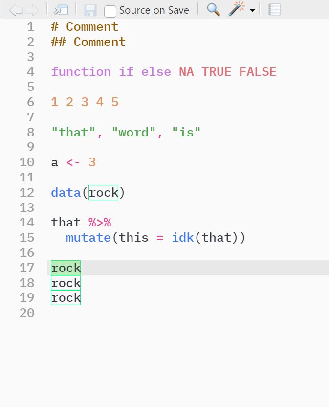
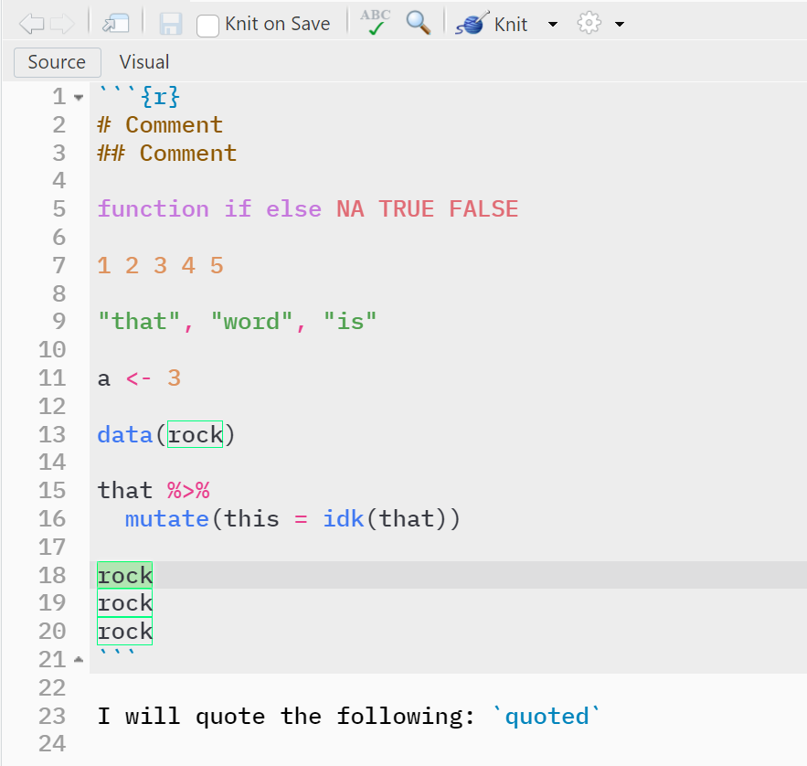
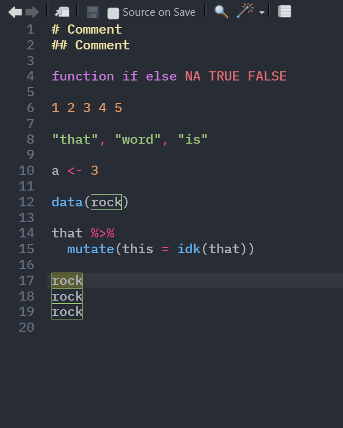
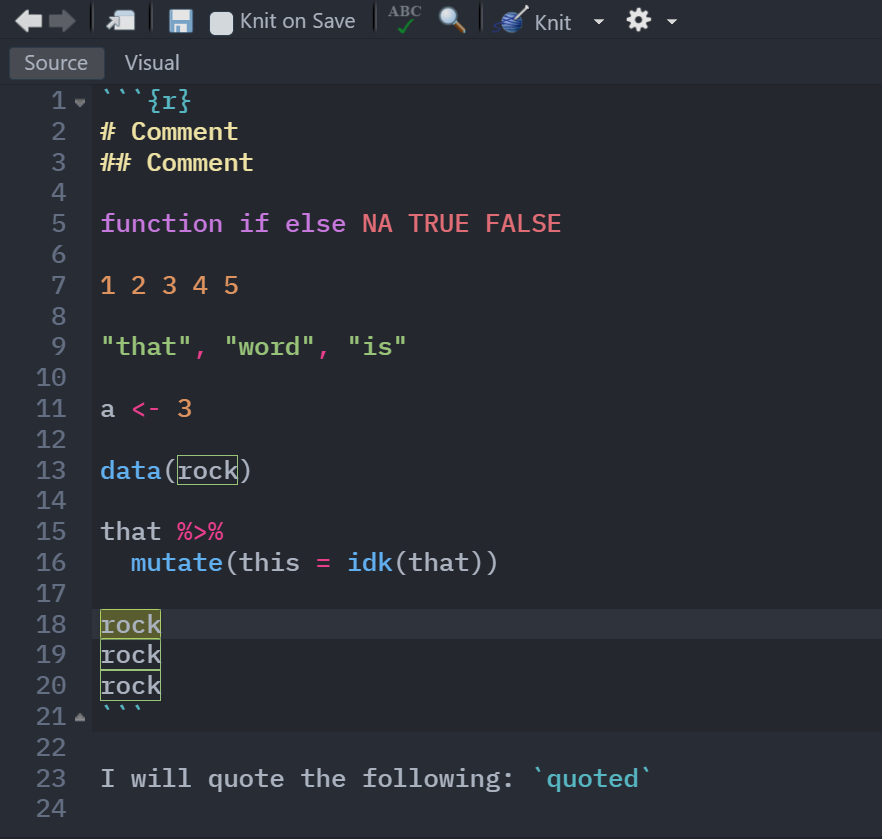

# My RStudio Themes

Derived from the
[`One Dark`](https://github.com/gadenbuie/rsthemes/blob/main/inst/themes/one-dark.rstheme)
and
[`One Light`](https://github.com/gadenbuie/rsthemes/blob/main/inst/themes/one-light.rstheme)
themes from the [`rsthemes`](https://github.com/gadenbuie/rsthemes) package.

Changes are mostly for improved visibility including, but not limited to,
comments and highlights/selections.

## Light theme

### R script

### R markdown

## Dark theme

### R script

### R markdown

