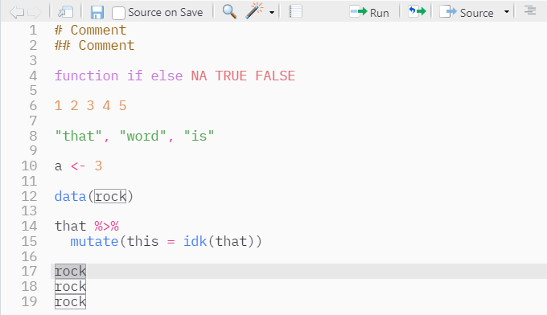
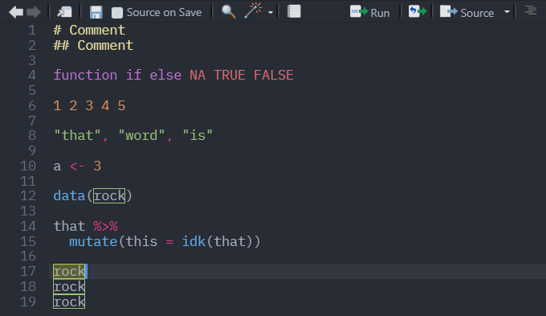

# adam-rstheme

Derived from the
[`One Dark`](https://github.com/gadenbuie/rsthemes/blob/main/inst/themes/one-dark.rstheme)
and
[`One Light`](https://github.com/gadenbuie/rsthemes/blob/main/inst/themes/one-light.rstheme)
themes from the [`rsthemes`](https://github.com/gadenbuie/rsthemes) package.

Changes are mostly for improved visibility, including, but not limited to
comments and highlights/selections.

## Light theme

## Dark theme

